# 結果まとめ

発話内容「物価の変動を考慮して, 給付水準を決める必要がある.」

|発話者|LSTM-Raw|LSTM-Normalize|LSTM-Filter|BLSTM-Raw|BLSTM-Normalize|BLSTM-Filter|
|---|---|---|---|---|---|---|
|M1|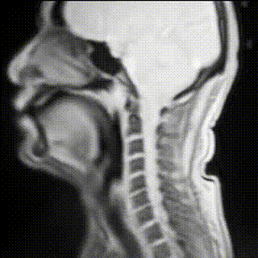|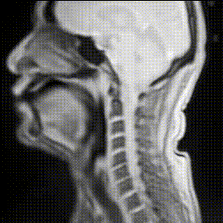|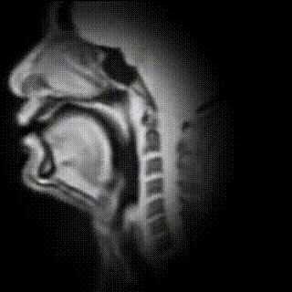|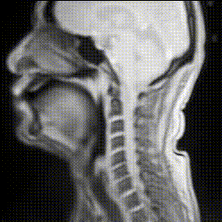|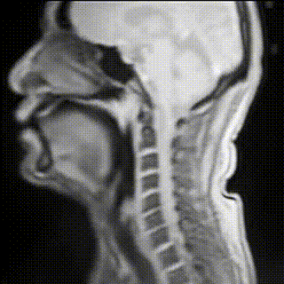|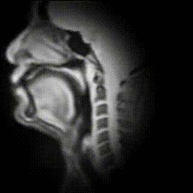|
|M2|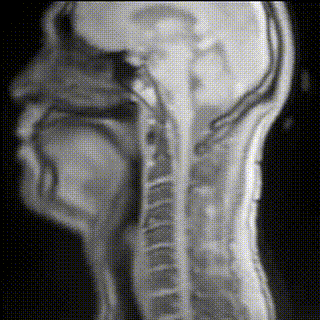|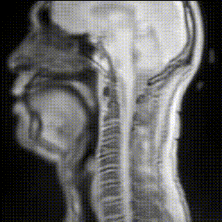|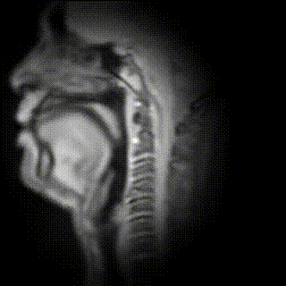|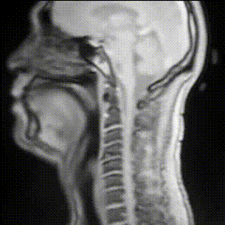|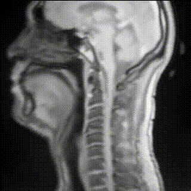|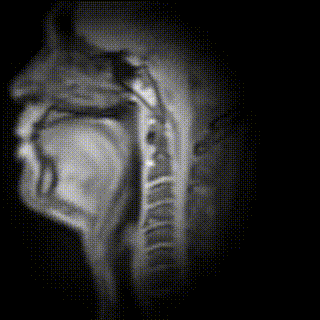|
|F1|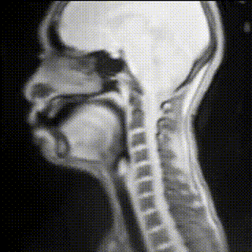|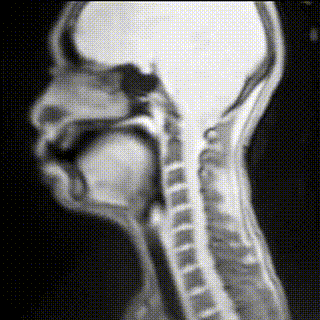|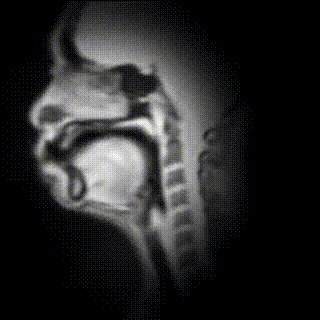|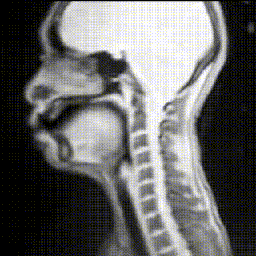|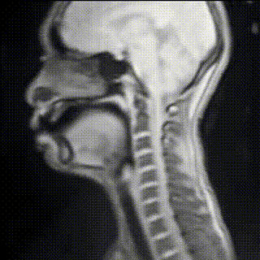|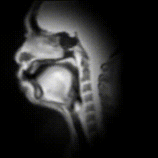|
|F2|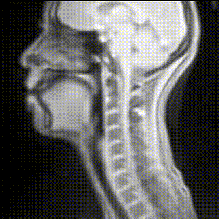|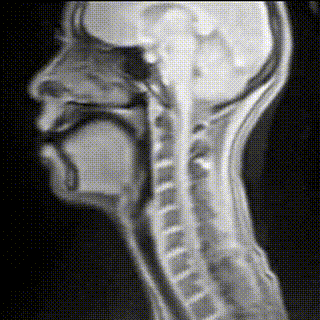|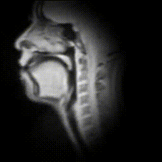|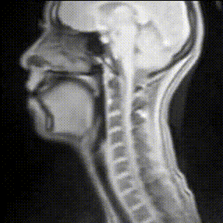|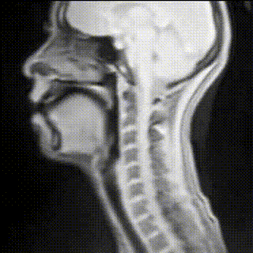|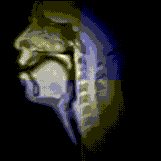|

発話内容「ワインと, 日本酒とを問わず, 原産地, 成分表示を急ぐべきではないか.」

|発話者|LSTM-Raw|LSTM-Normalize|LSTM-Filter|BLSTM-Raw|BLSTM-Normalize|BLSTM-Filter|
|---|---|---|---|---|---|---|
|M1|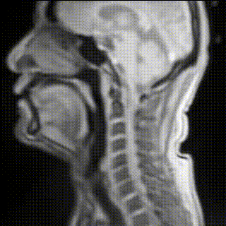|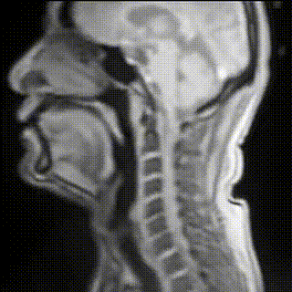|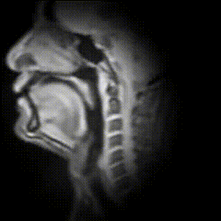|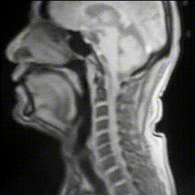|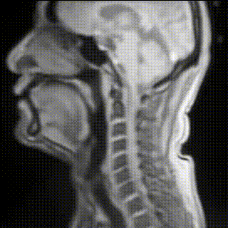|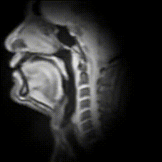|
|M2||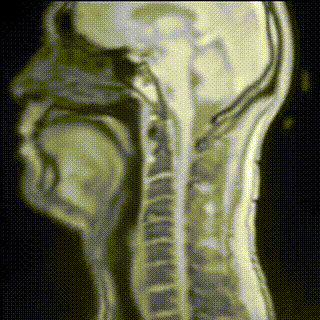|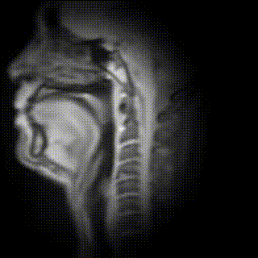|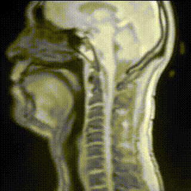|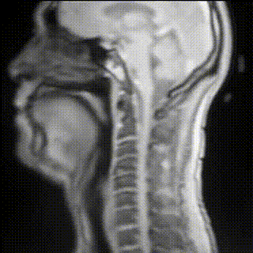|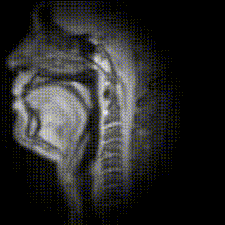|
|F1|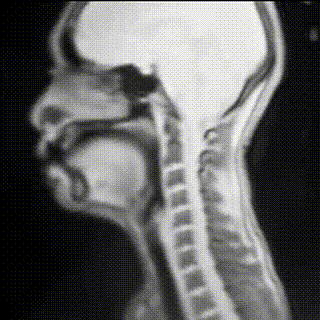|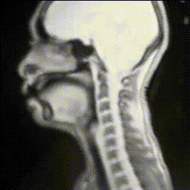|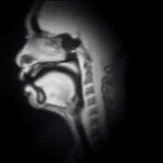|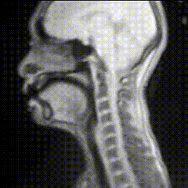|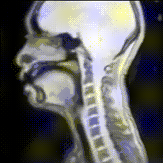|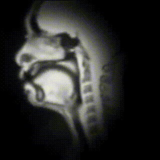|
|F2|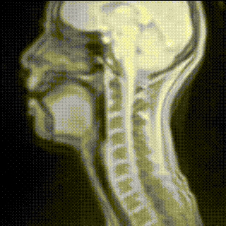|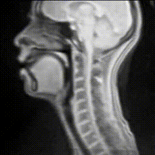|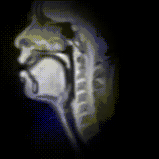|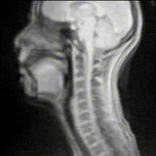|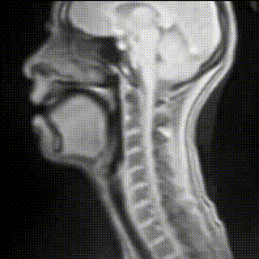|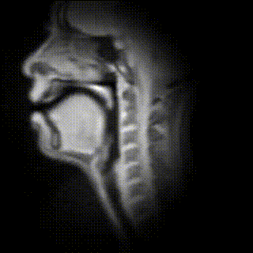|

発話内容「生きた潤滑油です.」

|発話者|LSTM-Raw|LSTM-Normalize|LSTM-Filter|BLSTM-Raw|BLSTM-Normalize|BLSTM-Filter|
|---|---|---|---|---|---|---|
|M1|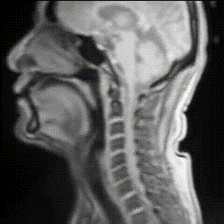|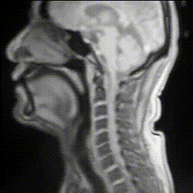|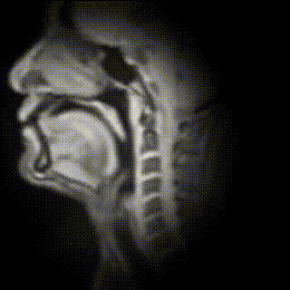||||
|M2|||||||
|F1|||||||
|F2|||||||

発話内容「夫人名義になっている住宅の半分を, わざわざ除いて公表する.」

|発話者|LSTM-Raw|LSTM-Normalize|LSTM-Filter|BLSTM-Raw|BLSTM-Normalize|BLSTM-Filter|
|---|---|---|---|---|---|---|
|M1|||||||
|M2|||||||
|F1|||||||
|F2|||||||

発話内容「墓地とはまた別種の, 神秘性が潜んでいるように思われた.」

|発話者|LSTM-Raw|LSTM-Normalize|LSTM-Filter|BLSTM-Raw|BLSTM-Normalize|BLSTM-Filter|
|---|---|---|---|---|---|---|
|M1|||||||
|M2|||||||
|F1|||||||
|F2|||||||

発話内容「夕食は, 一行がそろって, 刺身と, 牛肉の鉄板焼きをつつく.」

|発話者|LSTM-Raw|LSTM-Normalize|LSTM-Filter|BLSTM-Raw|BLSTM-Normalize|BLSTM-Filter|
|---|---|---|---|---|---|---|
|M1|||||||
|M2|||||||
|F1|||||||
|F2|||||||

発話内容「そのあと, 数名で, 六本木のスシ屋に行った..」

|発話者|LSTM-Raw|LSTM-Normalize|LSTM-Filter|BLSTM-Raw|BLSTM-Normalize|BLSTM-Filter|
|---|---|---|---|---|---|---|
|M1|||||||
|M2|||||||
|F1|||||||
|F2|||||||

発話内容「五十五歳だって, うれしいときはうれしいのだ.」

|発話者|LSTM-Raw|LSTM-Normalize|LSTM-Filter|BLSTM-Raw|BLSTM-Normalize|BLSTM-Filter|
|---|---|---|---|---|---|---|
|M1|||||||
|M2|||||||
|F1|||||||
|F2|||||||

発話内容「父はたばこを吸い, 母はぼんやりしていた.」

|発話者|LSTM-Raw|LSTM-Normalize|LSTM-Filter|BLSTM-Raw|BLSTM-Normalize|BLSTM-Filter|
|---|---|---|---|---|---|---|
|M1|||||||
|M2|||||||
|F1|||||||
|F2|||||||

発話内容「イランに, 天気予報は無い.」

|発話者|LSTM-Raw|LSTM-Normalize|LSTM-Filter|BLSTM-Raw|BLSTM-Normalize|BLSTM-Filter|
|---|---|---|---|---|---|---|
|M1|||||||
|M2|||||||
|F1|||||||
|F2|||||||

