# Results

This page summarises the results in the research presentation of INTERSPEECH 2024 _"Preprocessing for acoustic-to-articulatory inversion using real-time MRI movies of Japanese speech (Anna Oura, Waseda university)"_ .
 This slide contains results based on data that is not publicly available. Therefore, this page will be closed after the conclusion of INTERSPEECH 2024.

If you have any questions or comments, please fill in [this form](https://forms.gle/rteWb6LYDDrQ5uAV7).

---

The content of the speech is "物価の変動を考慮して, 給付水準を決める必要がある."

|Speaker|LSTM-Raw|LSTM-Normalize|LSTM-Filter|BLSTM-Raw|BLSTM-Normalize|BLSTM-Filter|
|---|---|---|---|---|---|---|
|M1||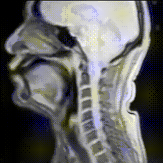|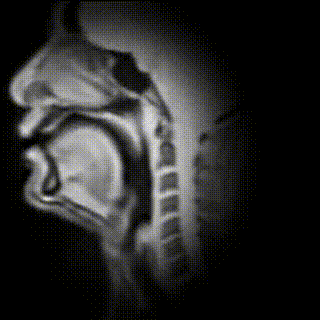|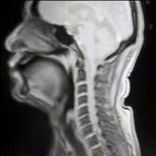|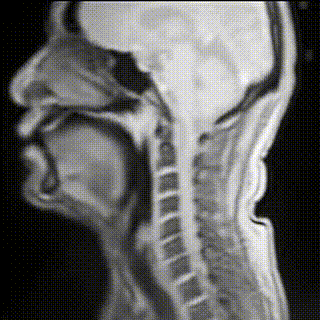|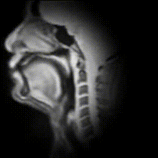|
|M2|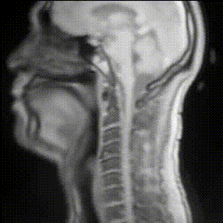|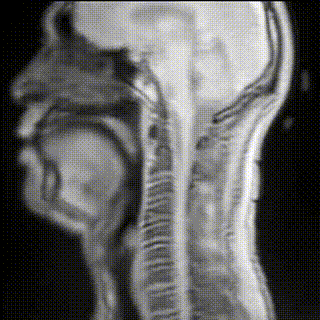|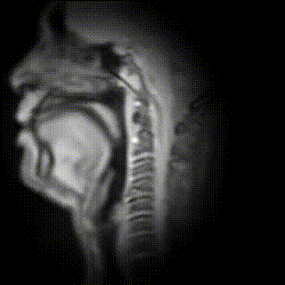|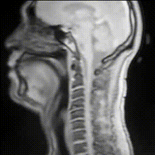|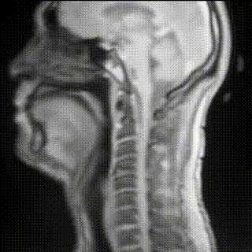|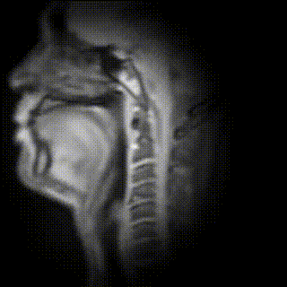|
|F1|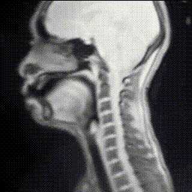|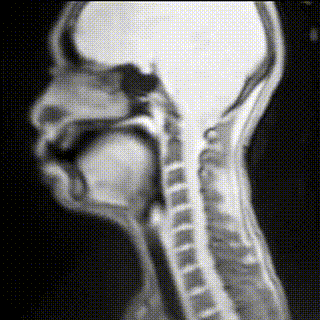|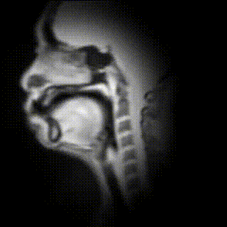|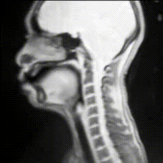|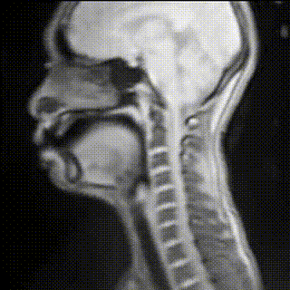||
|F2|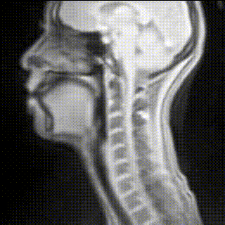|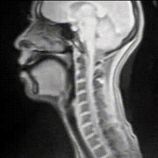|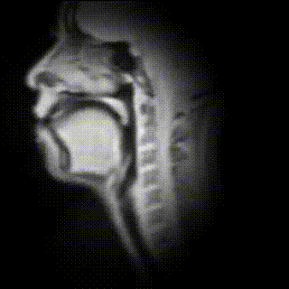|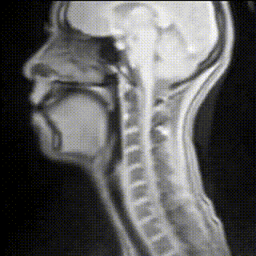|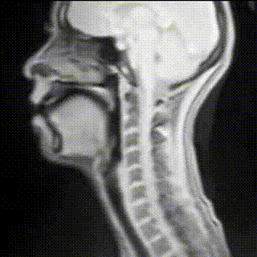|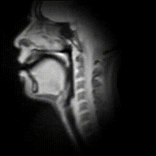|

The content of the speech is "ワインと, 日本酒とを問わず, 原産地, 成分表示を急ぐべきではないか."

|Speaker|LSTM-Raw|LSTM-Normalize|LSTM-Filter|BLSTM-Raw|BLSTM-Normalize|BLSTM-Filter|
|---|---|---|---|---|---|---|
|M1|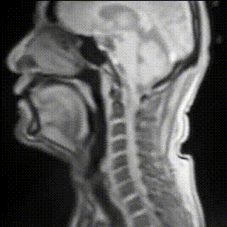|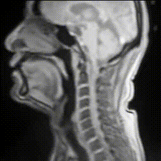|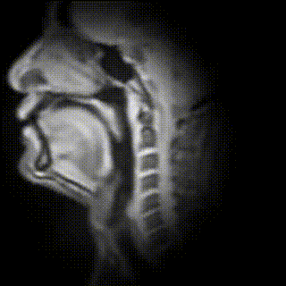|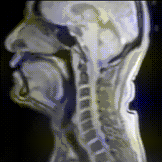|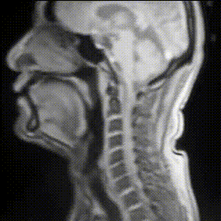|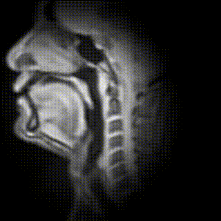|
|M2|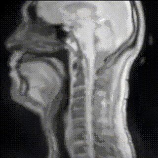||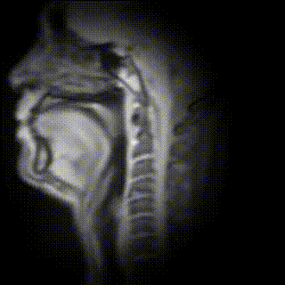|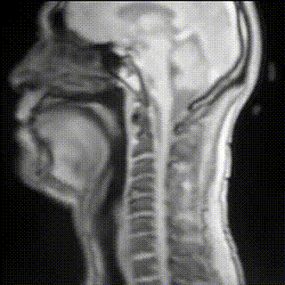|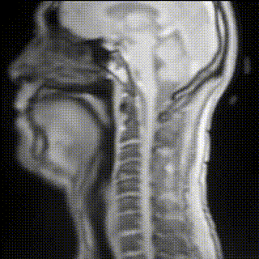||
|F1|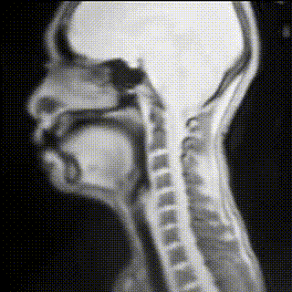|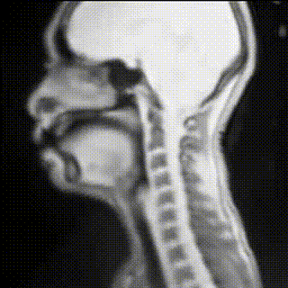|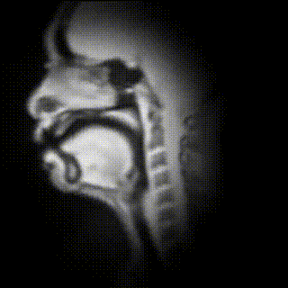|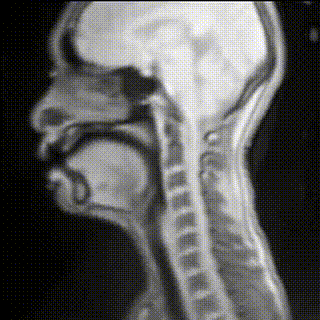|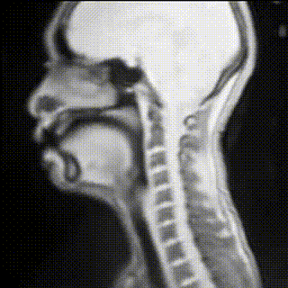|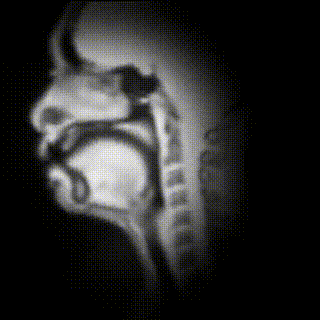|
|F2|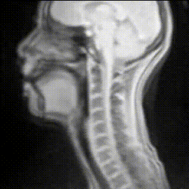|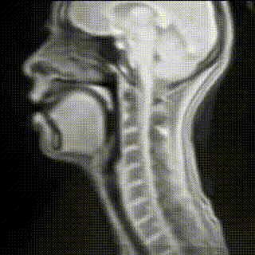|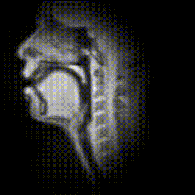|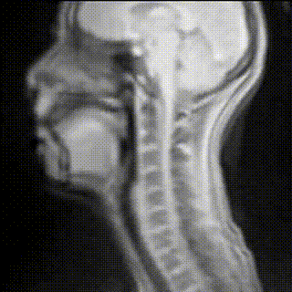|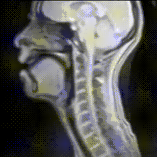|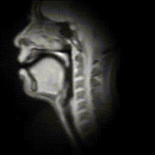|

The content of the speech is "生きた潤滑油です."

|Speaker|LSTM-Raw|LSTM-Normalize|LSTM-Filter|BLSTM-Raw|BLSTM-Normalize|BLSTM-Filter|
|---|---|---|---|---|---|---|
|M1|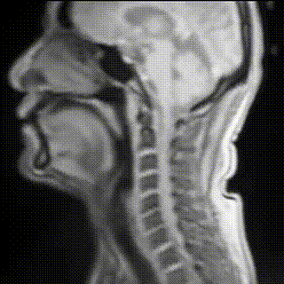|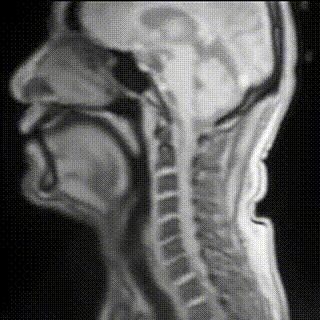|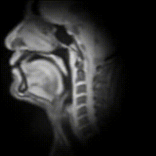|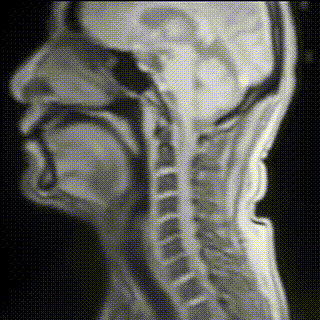|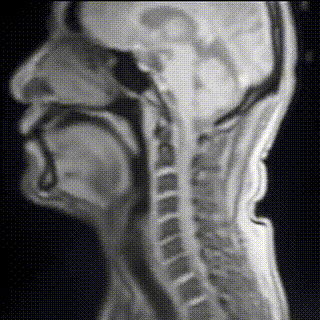|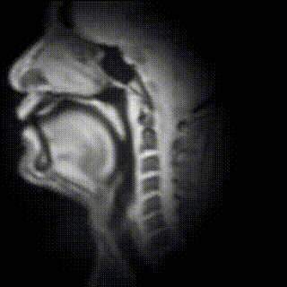|
|M2|||||||
|F1|||||||
|F2|||||||

The content of the speech is "夫人名義になっている住宅の半分を, わざわざ除いて公表する."

|Speaker|LSTM-Raw|LSTM-Normalize|LSTM-Filter|BLSTM-Raw|BLSTM-Normalize|BLSTM-Filter|
|---|---|---|---|---|---|---|
|M1|||||||
|M2|||||||
|F1|||||||
|F2|||||||

The content of the speech is "墓地とはまた別種の, 神秘性が潜んでいるように思われた."

|Speaker|LSTM-Raw|LSTM-Normalize|LSTM-Filter|BLSTM-Raw|BLSTM-Normalize|BLSTM-Filter|
|---|---|---|---|---|---|---|
|M1|||||||
|M2|||||||
|F1|||||||
|F2|||||||

The content of the speech is "夕食は, 一行がそろって, 刺身と, 牛肉の鉄板焼きをつつく."

|Speaker|LSTM-Raw|LSTM-Normalize|LSTM-Filter|BLSTM-Raw|BLSTM-Normalize|BLSTM-Filter|
|---|---|---|---|---|---|---|
|M1|||||||
|M2|||||||
|F1|||||||
|F2|||||||

The content of the speech is "そのあと, 数名で, 六本木のスシ屋に行った.."

|Speaker|LSTM-Raw|LSTM-Normalize|LSTM-Filter|BLSTM-Raw|BLSTM-Normalize|BLSTM-Filter|
|---|---|---|---|---|---|---|
|M1|||||||
|M2|||||||
|F1|||||||
|F2|||||||

The content of the speech is "五十五歳だって, うれしいときはうれしいのだ."

|Speaker|LSTM-Raw|LSTM-Normalize|LSTM-Filter|BLSTM-Raw|BLSTM-Normalize|BLSTM-Filter|
|---|---|---|---|---|---|---|
|M1|||||||
|M2|||||||
|F1|||||||
|F2|||||||

The content of the speech is "父はたばこを吸い, 母はぼんやりしていた."

|Speaker|LSTM-Raw|LSTM-Normalize|LSTM-Filter|BLSTM-Raw|BLSTM-Normalize|BLSTM-Filter|
|---|---|---|---|---|---|---|
|M1|||||||
|M2|||||||
|F1|||||||
|F2|||||||

The content of the speech is "イランに, 天気予報は無い."

|Speaker|LSTM-Raw|LSTM-Normalize|LSTM-Filter|BLSTM-Raw|BLSTM-Normalize|BLSTM-Filter|
|---|---|---|---|---|---|---|
|M1|||||||
|M2|||||||
|F1|||||||
|F2|||||||

