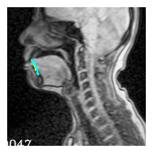

# 0720_MTG
## 課題
- 資料数を増やしたことで、clear と un_clear の明確な違いが見えるかを検証。

***
***

## やったこと
### データ選定
#### 手法
- 評価実験を3人で実行。
- 以下の条件に従って、使用するデータを選定。
  - 全員 clear/un_clear 判定だった資料を用いる。
  - ひとまず、なるべく同じ条件下で2群を比較する。
    - 同じ発話者数。
    - 全て同じ 13.79 fps の資料。
    - (なるべく)同じ性別・出身地の組み合わせ。
  - 群内で発話者の被りは無し。つまりデータ数＝発話者数。
  - 画像がおかしくなっているもの、また音声が不明瞭なもの（ラーと長く言っているとか）は除く。
- 対象とする画像は、舌尖と硬口蓋が接触する3フレーム前から、離れた後6フレーム目まで。

#### 結果
対象となったデータは下記の通り。

- clear 群

|wav|start_time|end_time|gender|dialect|
|---|---|---|---|---|
|0|2.70193473|3.288|F|KI|
|11|2.685934735|3.393032632|F|ST|
|13|2.363869471|3.401548949|M|KI|
|9|2.310451051|2.904516316|M|ST|

- un_clear 群

|wav|start_time|end_time|gender|dialect|
|---|---|---|---|---|
|6|2.453934735|3.160516316|F|KI|
|12|2.453418419|3.184516316|F|ST|
|49|2.613934735|3.480516316|M|KI|
|50|3.219869471|4.168|F|no|

***

### 舌尖検出
「clear と un_clear で、舌尖の動かす方向に差があるのでは」との仮説を基とした検証。

#### 手法
- clear と un_clear それぞれ4名ずつ。
- 4点によるアフィン変換で、個人内の正規化を実行。
- 舌尖を手動でアノテーション。
- 舌接触前を黄色で、接触後を水色の線で描画。

#### 結果
|file|pngs|
|---|---|
|clear|
|un_clear|

#### 考察
- なんとなく、un_clear 群は往復で軌跡が重なっている？？
- un_clear は女性が多い → 生理学的に、口腔が小さいと発話しにくい？
  - 対して、clear 群の女性は顎を良く動かしている。→ 口腔が小さくても**顎を大きく動かして広げる**ことで上手に発話できる？？
  - **口腔の広さに対して舌をどれだけ動かしているか**、を見ても良いかもしれない。
- 舌の運動自体よりも、口腔の広さ・・・？

***

### 顎の角度
「clear の方が顎をよく動かしているのでは」との仮説を基とした検証。
#### 手法
- clear と un_clear それぞれ4名ずつ。正規化処理済みの画像を対象とする。
- 正規化処理でアノテーションした下の3点を利用して、顎の角度を算出。（調音モデルの先行研究を参考に。）

<画像>

#### 結果
/ra/ 発話時の複数フレームを対象に顎角度の平均値をまとめる。

||data|ave|std|
|---|---|---|---|
|clear|00|39.05|2.38|
|clear|09|38.46|2.22|
|clear|11|40.77|5.55|
|clear|13|38.59|1.00|
|un_clear|06|30.16|0.87|
|un_clear|12|30.89|2.90|
|un_clear|49|37.77|0.66|
|un_clear|50|33.09|1.20|

「clear の方が顎をよく動かしている」という仮定なので、つまり「clear の方が標準偏差値が大きい」となる。そこで、算出された標準偏差を対象に検定をしてみた。
- F検定: p=.159 → 等分散仮定できる
- T検定(2標本等分散仮定): p=.128 → 有意差は認められない

#### 考察
- 有意傾向はある(?)が、有意差はない。
- 一人一人確認すると、下記のことが言えそう。
  - clear でも 13 の方はあまり顎を動かしていない。→　顎の動きを舌尖で代用している？そもそも口腔が広から、顎を動かす必要がない？
  - un_clear でも 06 の方は比較的大きめに動かしている。→ 顎を動かしているけど舌尖を動かしていないとか？
- ただ単に顎の開きだけではなく、**口腔の広さと舌尖の動きの関係**を見た方が良いかもしれない。

***

### 口腔面積と舌の移動距離の比較
「clear は口腔が小さくても顎を動かしている一方で、un_clear は顎も舌もあまり動かしていないのではないか」との仮説を基とした検証。

- 口腔平均面積/舌尖最大移動距離 を求める。
  - clear は、口腔が小さくても舌尖移動距離が大きいから、値は小さくなるはず。
  - un_clear は、口腔が小さくても舌尖移動距離も小さいままだから、値は大きくなるはず。

#### 手法
- clear と un_clear それぞれ4名ずつ。正規化処理済みの画像を対象とする。
- 口腔平均面積/舌尖最大移動距離 を求める。
  - 口腔は下記の5点で求められるものと仮定する。/ra/ 発話時の複数フレームを対象に手動でアノテーションをし、面積を求め、その平均の値を代表値とした。
  - 舌尖は、上記のアノテーション結果を利用する。上下方向で最大値・最小値をとる2点を求め、その2点の直線距離を代表値とした。

<画像>

#### 結果
下記のようになった。

||data|ave_area/distance|
|---|---|---|
|clear|00|179|
|clear|09|242|
|clear|11|137|
|clear|13|233|
|un_clear|06|264|
|un_clear|12|225|
|un_clear|49|281|
|un_clear|50|264|

||ave|std|
|---|---|---|
|clear|197.8|49.1|
|un_clear|258.5|23.7|

試しにt検定をしてみた。
- F検定: p=.131 → 等分散仮定できる
- T検定(2標本等分散仮定): p=.067 → 有意傾向にある

#### 考察
- やや有意傾向。(有意水準5%だと有意差なし。) 仮説はある程度支持できる？
- ただし、サンプル数少ないのが気になる。

***

### 総括
- clear と un_clear それぞれ4名を対象に、un_clear の違いはどこに生じるかを考察した。
- まず、舌尖検出をおこなってみた。結果、以下の考察が得られた。
  - un_clear 群は往復で軌跡が重なっている？？
  - un_clear は女性が多い → 生理学的に、口腔が小さいと発話しにくい？
    - 対して、clear 群の女性は顎を良く動かしている。→ 口腔が小さくても**顎を大きく動かして広げる**ことで上手に発話できる？？
- そこで、まずは「clear の方が顎をよく動かしているのでは」との仮説を基に、顎の開き角度を調査してみた。結果、以下の考察が得られた。
  - 有意傾向はある(?)が、有意差はない。
  - clear でもあまり顎を動かしていない方がいる。→　顎の動きを舌尖で代用している？そもそも口腔が広から、顎を動かす必要がない？
  - un_clear でも比較的大きめ顎を動かしている方がいる。→ 顎を動かしているけど舌尖を動かしていないとか？
  - ただ単に顎の開きだけではなく、**口腔の広さと舌尖の動きの関係**を見た方が良いかもしれない。
- そこで次に、「clear は口腔が小さくても顎を動かしている一方で、un_clear は顎も舌もあまり動かしていないのではないか」との仮説を基に、口腔面積と舌尖移動距離の比率を調査した。結果、以下の考察が得られた。
  - やや有意傾向。(有意水準5%だと有意差なし。) 仮説はある程度支持できる？
  - ただし、サンプル数少ないのが気になる。

***
***

## 議事録

## 課題
