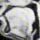
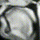

# 2022_1215_MTG

目次
- [前回の課題](#前回の課題)
- [現状の進捗](#現状の進捗)
  - [データ](#データ)
  - [手法](#手法)
  - [結果](#結果)
  - [今後の展望](#今後の展望)
- [フィードバック](#フィードバック)

## 前回の課題
- 舌付近の 100×100 px を、68×68 px の大きさで読み込み、学習。
  - 顔の位置がズレていることによって、余計な「揺れ」が生じている。
- 課題
  - 顔全体を使って位置合わせを実行したい。
  - 先行研究では前処理はどうやっているか？

|全体|トリミング後|
|---|---|
|||

## 現状の進捗
今回主にやったこと：
- MRIに位置合わせとノイズ除去を実行して学習。
- 先行研究との違いを確認。

### データ
- 任意の一人の話者（`speaker__id = 1`）のMRI。
- 全て 27 fps の動画。
  - 210 movies × 513 frames = 107,730 frame 
- 無声区間も含んだ動画全体。
- 元の MRI は 256×256 px。舌付近の 100×100 px を、68×68 px の大きさで読み込む。

### 手法
**全体の流れ**
- 入力する動画を準備。
  - 1: 生の MRI
  - 2: 位置合わせを実行した MRI
  - 3: 位置合わせ＋バイラテラルフィルタ(以下bil)を実行した MRI
- 舌付近の 100×100 px を、68×68 px の大きさで読み込む。
- 学習を実行。今回は BLSTM (先行研究より、最も精度が高いと言われている)。 
  - 210 files (valid : 4 files, test : 2 files, train : others)
  - epochs = 100, batch_size = 128, shuffle = True, verbose = 1
- test データを使って、画像を推定し動画を出力。
- MSE を用いて、元画像と推定画像の誤差を評価。
  - MSE : 平均二乗誤差

**位置合わせの流れ**
- それぞれの動画の先頭画像を取得 = 210 個の画像
- 210 個の画像に対して、全て同じ強さの bil をかける。また、左下の数字を除去する。
  - こうした方が位置合わせ後の「揺れ」が少なかった。
- 210 個の画像のうち、任意の1つの画像を基準画像として、それ以外の画像と基準画像との誤差(x, y方向)を算出する。
  - OpenCV の phaseCorrelate 関数を用いた。
- 算出された誤差を基に、各動画における画像全てを同じだけ平行移動させ、動画を保存する。
  - なおこの動画化の際、各画像に bil をかけるバージョンとかけないバージョンの2つを実行した。

**先行研究との違い**
- 先行研究文献([PDF](https://arxiv.org/pdf/2008.02098.pdf), [github](https://github.com/BME-SmartLab/speech2mri))を読んで確認。
  - **※ まだPDFは読み切れていないので要確認。**

||先行研究|本研究|
|---|---|---|
|データ詳細|USC-TIMIT MRI DB|real-time MRI DB for Japanese|
|学習データ数|92 files (valid : 4 files, test : 2 files, train : others)|210 files (valid : 4 files, test : 2 files, train : others)|
|画像のサイズ|68×68(元のMRIサイズがこれっぽい)|256×256 を 68×68 に|
|撮影速度|23.18|27.17|
|フレーム数|1024|513|
|サンプリング周波数|20000|20000|
|前処理|不明、周囲を暗くしていそう？|トリミング|

**客観的評価指標の算出の流れ**
- オリジナルの動画と出力動画の、それぞれ同じフレームの画像を比較し、評価値を算出。
  - なお、出力動画に bil をかけている場合は、比較するオリジナル動画にも同じ強さの bil をかけた。
  - **※ ここの計算がプログラム上誤っている可能性が今出てきたので、後ほど確認する。**
- 全フレームの評価値を算出したら、その平均値を算出。これを代表値とした。

### 結果
**位置合わせの結果**
- 先頭画像(210個の画像)を繋ぎ合わせてみた。
- 時々ズレは生じていそうではあるが、概ねの位置合わせは可能になったように見える。

|before|after|
|---|---|
|||

**MRI全体を学習した際の推定結果**
- 「揺れ」は alinged の方が無い。
- ただ、どちらも舌の動きがあまり見られないような。
  - やはり、画像の周囲を暗くする、舌付近だけに限定するなどの処理が必要か。
- alinged だと、位置合わせの推定が上手く行かなかったデータも含まれているので、大きく画像が揺れている部分がある。

||original|rawMRI|alinged|
|---|---|---|---|
|result||||
|material|whole_original_MRI.mp4|whole_BLSTM_rawMRI.mp4|whole_BLSTM_alinged.mp4|

**トリミング後の推定結果**
- MSEから読み取れること。
  - 誤差：ali < ali+bil < rawMRI
  - 確かに、「揺れ」だけを見れば、rawMRI が最も揺れていそう。
- 目視より確認できること。
  - MRI全体を読みこんだ時ほどではないが、「舌の動き」はオリジナル動画と比較するとどれも不十分では。（舌は、少しは動いているが、ほぼ動いているように見えない。）
  - つまり、揺れが生じていない＋概ねの形状が推定できているため、MSEは良くなっている、ということが考えられる。
- ali < ali+bil となる理由。
  - 1: bil をかけると、背景か身体の部分かがハッキリする。＝正確な舌形状の比較が可能であるため、正しく精度を測ることができる。
  - 2: bil をかけると、MRIの濃淡情報などの情報が除外される。＝学習に必要な情報が除外されるため、精度が落ちる。

||original|rawMRI|alinged|alinged + bilateral|
|---|---|---|---|---|
|output movie|||||
|MSE|0|1628.7|1363.5|1578.3|
|material|roi_original_MRI.mp4|roi_BLSTM_rawMRI.mp4|roi_BLSTM_alinged.mp4|roi_BLSTM_bilateraled.mp4|

### 今後の展望
悩んでいる点
- トリミングの必要性
- bil の必要性
- 最終目標の設定(どこまで推定できていればOKか)

やるべきこと
- 研究目標を整理する。(今週中にやる。)
- データを有声区間だけにする。
- トリミングする箇所を設定し直す。

***

## フィードバック
- まずは、正規化をきちんとやった際にどのような結果が出力されるかをみたい。
  - 正規化の目標：上の before の動画が、口以外はピッタリと合う状態
  - 位置合わせの誤差を考慮した上でのDNNという考え方もあるが、これは正規化が上手くできた上で考えるべきでは。
  - 正規化できれば、あとは画像にフェードをかけて、学習に不要な部分を暗くするとかができると良い。
- 考えられる方法
  - X, Y方向だけではなく、回転・拡大縮小も行う。
  - 口は除いて、背中や鼻の線など、固定化できる情報を用いる。
  - とりあえず手動で少数で正規化し、それで機械学習を検証してみるのも一手か。
  - 20年前くらいのカナデさん(?)の研究とか、参考になるかも。
- 今後の計画
  - 現状の正規化はどうやっているのか (X, Y方向だけ？) を確認。
  - OpenCVとかで、回転と拡大・縮小も含めた位置合わせ手法が無いかを調べる。
  - 次回MTGまでの計画を立てる。
    - 手動でアノテーションする？その時の基準は？
