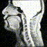

# 2022_1227_MTG

目次
- [前回の課題](#前回の課題)
- [現状の進捗](#現状の進捗)
  - [データ](#データ)
  - [手法](#手法)
  - [結果](#結果)
  - [今後の展望](#今後の展望)
- [フィードバック](#フィードバック)

## 前回の課題
- 概要：OpenCV の関数を用いて、平行移動(X, Y方向)による正規化を実行した。
- 結果：概ねの位置合わせはできたが、まだ「揺れ」が観測される。
- 課題：顔の位置合わせをきちんと行いたい。
  - 学習の方法などに関しては、その後に取り組む。

|before|after|
|---|---|
|||

## 現状の進捗
今回主にやったこと：
- [メイン] 複数の方法で顔の位置合わせを実行。
- [補足] 位置合わせしたもので学習を実行。

### 先行研究
本研究と同様のプログラムを用いている先行研究を読んだ。([PDF](https://arxiv.org/pdf/2008.02098.pdf))

BLSTMによる学習結果(正確にはこの結果は桂田先生のところのもの)
 

前処理に関して、次のような記載(意訳)があった。
> - 本研究では USC-TIMITデータベースを用いたが、頭部位置が不安定であるため、出力結果からは鼻位置のズレが観察される。
> - 我々の研究では生のMRIを用いており、いかなる前処理もしていない。
> - したがって、ノイズやアーチファクトの除去などをすれば、精度が向上する可能性がある。

これより、前処理として顔の位置合わせを行うことの効果は、先行研究からも示唆される。

### データ
今回は推定精度よりも位置合わせに注目したいので、**任意の11個の動画資料を対象**とした。
- 一人の話者（`speaker__id = 1`）のMRIのうち、**任意の11個の動画資料**を使用。
- 全て 27 fps の動画。
  - 11 movies × 513 frames = 5,643 frame 
- 無声区間も含んだ動画全体。

### 手法
以下の4つの動画資料で比較。
1. 生の MRI 動画資料
2. OpenCV によって算出された誤差を基とした、平行移動による正規化
3. OpenCV によって算出された誤差を基とした、平行移動＋拡大縮小＋回転による正規化
4. 任意の4点を手動でアノテーションした結果を基とした、アフィン変換による正規化

**2. OpenCV の平行移動による正規化**
 前回の MTG で報告したものと同様である。
- それぞれの動画の先頭画像を取得 = 11 個の画像
- 11 個の画像に対して、全て同じ強さの bil をかける。また、左下の数字を除去する。
- 11 個の画像のうち任意の1つの画像を基準画像として、それ以外の画像と基準画像との誤差(x, y方向)を算出する。
  - OpenCV の phaseCorrelate 関数を用いた。
- 算出された誤差を基に、各動画における画像全てを同じだけ平行移動させ、動画を保存する。

OpenCV の phaseCorrelate 関数に関しては、[こちら](https://qiita.com/miwazawa/items/1d5e51023db86ad5f053)に詳細が書かれていた。
 ※ まだあまりよく理解できていない内容なので、要確認。
> Phase Only Correlation (POC)、日本語で位相限定相関法というものがあります。
> 
> どんな手法かというと、それぞれの画像をフーリエ変換して、パワースペクトル画像を生成します。それらの相関をとった新たなパワースペクトル画像を生成し、最後に逆フーリエ変換することで相関の強かった座標のみがハイライトされたような画像が生成されます。
> そのピーク値の座標を求めることで一番相関の強い座標を得ることができるという手法です。
> 
> このようにフーリエ変換することで、現画像は振幅(輝度)と位相(像の輪郭)に分解されます。こうすることで輝度情報のみを扱っているテンプレートマッチングよりも判断材料が１つ増え、外乱の影響を受けにくくなったことがわかります。

**3. OpenCV の平行移動＋拡大縮小＋回転による正規化**
- それぞれの動画の先頭画像を取得 = 11 個の画像
- 11 個の画像に対して、全て同じ強さの bil をかける。また、左下の数字を除去する。
- 11 個の画像のうち任意の1つの画像を基準画像として、それ以外の画像と基準画像との誤差(x, y方向)を算出する。
  - OpenCV の phaseCorrelate 関数を用いた。
- 11個の画像の対数極座標を算出し、任意の1つの画像を基準画像として、それ以外の画像と基準画像との誤差(角度、スケール)を算出する。
  - OpenCV の phaseCorrelate 関数を用いた。
- 算出された誤差を基に、各動画における画像全てを同じだけ平行移動・回転・拡大縮小させ、動画を保存する。

上と同じ[こちら](https://qiita.com/miwazawa/items/1d5e51023db86ad5f053)のサイトには、以下のように詳細が書かれていた。
 ※ まだあまりよく理解できていない内容なので、要確認。
> Rotation Invariant Phase Only Correlation (RIPOC)、日本語で回転不変位相限定相関法というものがあります。
> 
> 字面からわかるように先ほどのPOCを改良した手法です。
> 
> これもかなりかいつまんで説明すると、フーリエ変換した後に、その画像を対数極座標に変換します。（2. 参考）
> こうすることで２次元座標(x, y)が対数極座標(ρ, θ) (ρ：ある点と原点との距離の対数、θ：x軸とのなす角)に変換されます。ですので、この極座標系では角度を2つの変数で表現できるようになります。
> そこに先ほどのPOCを使って画像の移動量を取得することで、角度を補正するという手法です。
> 
> 角度を補正できたら、後はまた平行移動の位置合わせを行って無事完了です。

**4. 手動アノテーションのアフィン変換による正規化**
- それぞれの動画の先頭画像を取得 = 11 個の画像
- 11 個の画像全てに対して、剛体部分である4点の座標を取得。
  - 歯茎、硬口蓋と軟口蓋の境界点、第１脊椎、第３脊椎。
  - ※ もっと確実な別の場所でも良いかも。
- 11 個の画像のうち任意の1つの画像を基準画像として、それ以外の画像と基準画像の4点の誤差を算出する。
- 算出された誤差を基に、各動画における画像全てを同じだけアフィン変換させ、動画を保存する。

 

### 結果

**正規化の結果**
- 時々大きくズレているものがありそうなので確認したところ、1枚の画像 (004.png) が元から大きくズレていることが分かった。
  - 004.png の誤差（OpenCV による算出）
    - Shift X: -21.636586000413814
    - Shift Y: 0.059348802179883364
    - angle: -1.1120495334008718
    - scale:0.9974162353906748
  - 明らかに平行移動が上手く行って無さそう。
    - 自動算出の限界？
- 考えられる解決策（Discussion Point）
  - 自動で検出し、明らかに大きなズレ（例：x 方向に 100px とか）が見られた画像は除去する。
    - メリット：自動化できるため、時間はかからない。
    - デメリット：画像データ数が減ってしまう。→ そこだけは手動？
  - 全ての画像をアノテーションし、位置合わせを行う。
    - メリット：確実な位置合わせが可能。
    - デメリット：時間がかかる。（今のところは 210 個の動画なので、できなくはない。）

||1. rawMRI|2. 平行移動(OpenCV)|3. 平行+回転+ 拡大縮小(OpenCV)|4. アフィン変換(手動)|
|---|---|---|---|---|
|000.png (基準画像)|||||
|001.png|||||
|002.png|||||
|003.png|||||
|**004.png**|||||
|005.png|||||
|006.png|||||
|007.png|||||
|008.png|||||
|009.png|||||
|010.png|||||

**学習・推定結果**
- （データは少数だが、）それぞれの画像群で BLSTM の学習を実行した結果は以下のようになった。
  - valid files ['000.mp4', '001.mp4']
  - test files ['002.mp4', '003.mp4']
  - train files ['004.mp4', '005.mp4', '006.mp4', '007.mp4', '008.mp4', '009.mp4', '010.mp4']
- 結果からの考察
  - データ数が少ないので口がほぼ動いていない点は保留。
  - 1.2.3.では時々、顔全体の位置がズレている。4.は頭部にズレが見られるが、口の位置は概ねズレていなさそう？
    - 頭部のズレは、グラデーションをかけることで除去可能か。

|元動画|1. rawMRI|2. 平行移動(OpenCV)|3. 平行移動+回転+拡大縮小(OpenCV)|4. アフィン変換(手動)|
|---|---|---|---|---|
||||||
||||||

### 今後の展望
- 手法に関して分からない点を調べる。
  - 画像に対するフーリエ変換をすると何が得られるのか。
  - 対数極座標とは何か。
- **どの正規化が良さそうか。**
  - 全て手動でアノテーションする？
  - 自動で検出し、一部は手動にする？
- グラデーションのフィルターをかける。
  - 途中まではプログラム完了。

## フィードバック
MTG終了後に記入予定。