# 2023_0620_MTG

目次
- [研究概要](#研究概要)
- [現状の進捗](#現状の進捗)
- [フィードバック](#フィードバック)

過去の資料
- [2022_1118](./2022_1118_MTG.md)
- [2022_1215](./2022_1215_MTG.md)
- [2022_1227](./2022_1227_MTG.md)

***
## 研究概要

> 背景

- 発話訓練＝自分の感覚だけで調音を制御するのは困難 ＝ 音声から調音を推定できれば良いのでは. 
- 先行研究
  - 海外の方：FC-DNN, CNN, LSTM で比較. LSTM が最も良い. 
  - 理科大の方：LSTM, BiLSTM, BiLSTM-CNN で比較. BiLSTM が最も良い. 
- 目的：既存の音声信号から調音運動を推定するモデル (音声-調音モデル) の改良. 
  - 発話者依存型 (1人の発話者を対象) .
  - 日本語 rtMRI データベースを使用. 

> データ

- 任意の一人の話者（`speaker__id = 1`）の rtMRI を対象とする.  
  - 男性, 標準語話者. 
- 全て 27 fps の動画とする. 
  - データ総数 : 210 movies
  - 210 movies × 513 frames = 107,730 frame 
- とりあえず, 現状では**任意の11個の動画資料を対象**とする. 

> 計画

- step1 : 前処理の検討. 
- step2 : モデルの改良.

***
## 現状の進捗

前回の MTG にて. 
- 千葉工大の輪郭データなどが応用して正規化できないか. 
  - A. 現在対象としている rtMRI データの中で, 輪郭データがあるものはなかった. 新たな輪郭データがあるかは別途確認する必要がある. 
- 周囲をぼかすフィルタリングはできないか. 
  - A. ぼかしたり, 暗くしたりするのをやってはみたが... 微妙. 
  - A. 先行研究で使っていた rtMRI データセットを確認してみたが, 前処理に関する議論はあまり触れられていない.  = 先行研究が使用していたコーパスでは, 前処理はおこなわれていない？
- アフィン変換は自由度が高すぎる？
  - A. アフィンの他に, 回転・拡縮・平行による処理を追加. しかし, ガタガタしてしまった. 
- 固定点で合わせることは, 手動アノテーションによる誤差がある？
  - A. 今回の結果では固定点で合わせてしまっている. 
  - A. 輪郭データは無さそう. セグメンテーションとか？

本日伺いたい内容. 
- 正規化処理の妥当性.
- フィルタリングの妥当性. 

### 先行研究調査

> Speaker dependent acoustic-to-articulatory inversion using real-time MRI of the vocal tract.

CSAPÓ, Tamás Gábor. Speaker dependent acoustic-to-articulatory inversion using real-time MRI of the vocal tract. arXiv preprint arXiv:2008.02098, 2020.

本研究と同様のプログラムを用いている先行研究 ([PDF](https://arxiv.org/pdf/2008.02098.pdf)) .

前処理に関して, 次のような記載(意訳)があった. 
- 本研究では USC-TIMIT データベースを用いたが, 頭部位置が不安定であるため, 出力結果からは鼻位置のズレが観察される. 
- 我々の研究では生のMRIを用いており, いかなる前処理もしていない. 
- したがって, ノイズやアーチファクトの除去などをすれば, 精度が向上する可能性がある. 

BLSTMによる学習結果(正確にはこの結果は桂田先生のところのもの)
 

これより, 前処理として顔の位置合わせを行うことの効果は先行研究からも示唆されるのでは. 
 -> 疑問：そもそも, USC-TIMIT の方で何らかの位置合わせは行われていないのか？

> Real-time magnetic resonance imaging and electromagnetic articulography database for speech production research

NARAYANAN, Shrikanth, et al. Real-time magnetic resonance imaging and electromagnetic articulography database for speech production research (TC). The Journal of the Acoustical Society of America, 2014, 136.3: 1307-1311.

USC-TIMIT に関する先行研究 ([PDF](https://vikramr.com/pubs/USC-TIMIT-JASA2014-final.pdf)) . 

前処理に関する議論は, あまり書かれていなかった. 
 -> 何もしていない可能性が高い？
 -> 磁場の傾斜の掛け方によっては, 画像内にグラデーションが生じる可能性があるのでは. 

現在, 私が使っている rtMRI と比較してみた. 

||USC-TIMIT|real-time MRI DB|
|---|---|---|
|磁場|1.5T|3T|
|スライス厚|5mm|10mm|
|画面の大きさ|68×68|256×256|
|被験者|M5, F5|M14, F13|
|撮影速度 | 23.18 | 27.17|
|フレーム数 | 1024 | 513 |
|サンプリング周波数 | 20000 | 20000 |
|言語|英語|日本語|
|発話内容|460文セット ([web](https://data.cstr.ed.ac.uk/mocha/mocha-timit.txt)) |様々 |

1人あたりのデータ数で確認. 

||USC-TIMIT|real-time MRI DB|備考|
|---|---|---|---|
|データ全体の長さ(sec)|1,100|3,969|データ数(個) × データ1個当たりの秒数(sec/秒)
|1データあたりの長さ(sec)|44.2|18.9|データ1個当たりのフレーム数(frmaes) ÷ フレームレート(frames/sec)
|データ総数|25|210|
|総フレーム数(frames)|25,600|107,730|データ1個当たりのフレーム数(frames) × データ総数

これより, 以下のことが示唆されるか. 
- rtMRIDB を用いるメリット. 
  - 日本語への対応. 
  - 画像サイズが大きい＝より詳細な舌の運動を推定できる. 
  - 被験者数は多い. 
  - 1人当たりでみても, データは豊富. 
- rtMRIDB を用いるデメリット. 
  - データ数が多いぶん, 顔の位置のずれは多い可能性は高いか. 
    - 課題：撮影日ごとのデータ数を確認してみる. 

### 前処理

想定している流れ. 
- 正規化処理をして, 顔の位置を揃える. 
- フィルタリングして, 学習に不必要な部分を除去する. 
- 画像を用いて推定. (まだ取り組んでいない. )

#### 正規化処理

> 手法

いくつかの方法を試した.
1. アノテーションした点間の距離の合計値が最小になるように回転・拡大縮小・平行移動. 
2. アノテーションした点間の距離が最小になるようにアフィン変換. 
3. OpenCV による平行移動・回転・拡大縮小. 

**1. アノテーションした点間の距離の合計値が最小になるように回転・拡大縮小・平行移動**
- それぞれの動画の先頭画像を取得 = 11 枚の画像
- 11 枚の画像全てに対して, 剛体部分である4点の座標を取得. 
  - 歯茎、硬口蓋と軟口蓋の境界点, 第１脊椎, 第３脊椎. 
    - 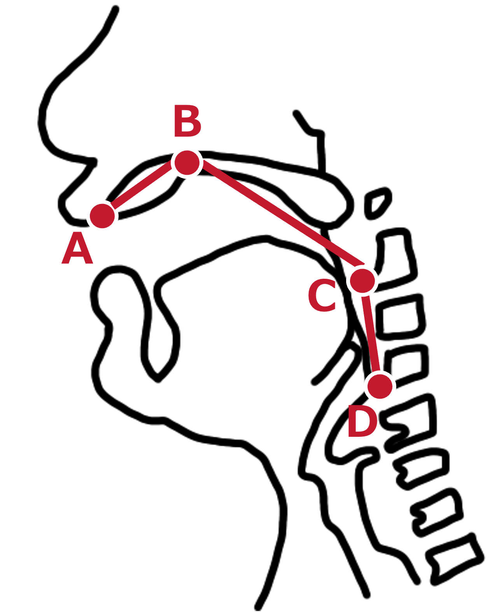
- 11 枚の画像のうち任意の1つの画像を基準画像として, それ以外の画像と基準画像の4点の誤差を算出する. 
  - d 点を合わせるように平行移動. 
  - a, b, c 点同士の距離の合計値が最小になるように回転・拡大縮小を決定. 
- 算出された誤差を基に, 他画像全てを回転・拡大縮小・平行移動. 

**2. アノテーションした点間の距離が最小になるようにアフィン変換**
- それぞれの動画の先頭画像を取得 = 11 枚の画像
- 11 枚の画像全てに対して, 剛体部分である4点の座標を取得. 
  - 上と同じ. 
- 11 枚の画像のうち任意の1つの画像を基準画像として, それ以外の画像と基準画像の4点の誤差を算出する. 
- 算出された誤差を基に, 他画像全てをアフィン変換. 

**3. OpenCV による平行移動・回転・拡大縮小**
- それぞれの動画の先頭画像を取得 = 11 枚の画像
- 11 枚の画像のうち任意の1つの画像を基準画像として, それ以外の画像と基準画像との誤差(x, y方向)を算出する. 
  - OpenCV の phaseCorrelate 関数を利用. 
- 11 枚の画像の対数極座標を算出し, 任意の1つの画像を基準画像として, それ以外の画像と基準画像との誤差(角度、スケール)を算出する. 
  - OpenCV の phaseCorrelate 関数を利用. 
- 算出された誤差を基に, 他画像全てを回転・拡大縮小・平行移動. 

> 結果

|0. rawMRI|1. 回転・拡縮・平行 (アノテーション)|2. アフィン変換 (アノテーション)|3. 回転・拡縮・平行 (OpenCV)|
|---|---|---|---|
|||||
|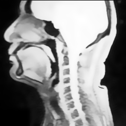|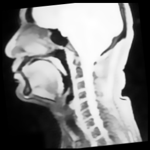|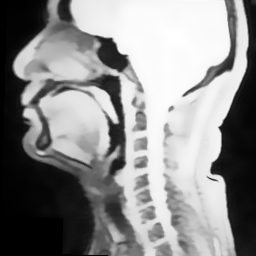|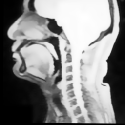|
|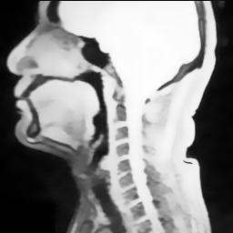|||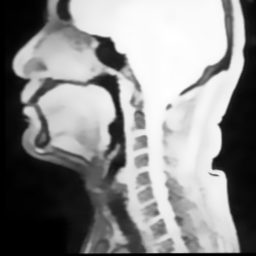|
|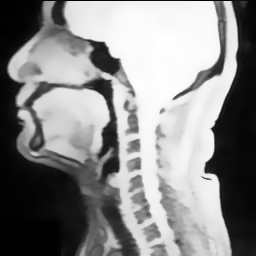|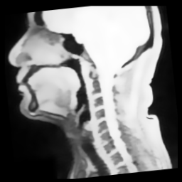|||
|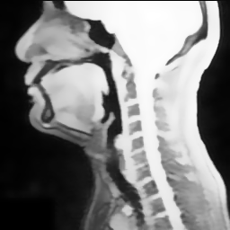|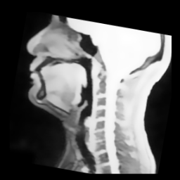|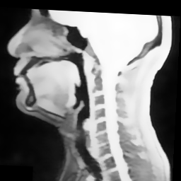|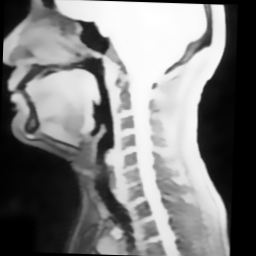|
|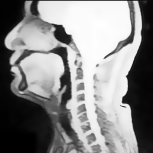|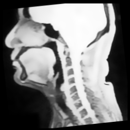|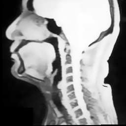||
|||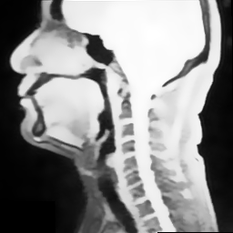||
||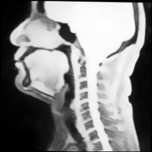|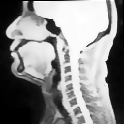||
||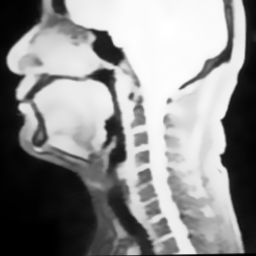|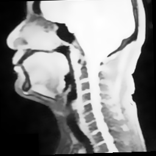||
||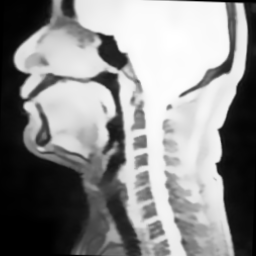|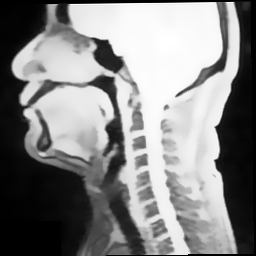||
|||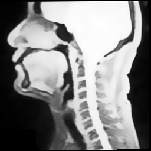||

> 考察

- 1 だとガタガタ. 
  - 距離の合計値の最小ではなく, 距離の平均が最小になるなどの処理が必要？
  - 明らかなズレは, 変換前に確認すべきか. 
  - そもそもアノテーションはあっている？
- 2 は一応, 位置合わせはできていそう. 
  - アノテーションの精度に強く依存する点が懸念.
- 3 は概ねあっているが, 時々ずれている. 
  - 明らかなズレは, 変換前に確認すべきか. 
  - 詳細な点を見ると, アノテーションをした方が確実性は薄い？
- その他
  - 学習過程によっては, ある程度のズレは吸収できるか？
  - アノテーションの有無, 妥当性. 

#### フィルタリング

> データ

とりあえず, 上の結果で一番揃っていた「2. アフィン変換(アノテーション)」の結果に応用した. 

> 手法

1. 黒いグラデーションをかける. 
2. ガウスフィルタによるぼかしをかける. 

**1. 黒いグラデーション**
- 上の「2. アフィン変換(アノテーション)」を施した画像 11 枚を利用. 
- 1 枚ずつフィルタリング. 透過した黒い四角形を 1 px ずつ狭くして描画. 
  - 徐々にグラデーションになるはず. 
  - 範囲 : x は 130 px, y は 56 px 分. 
- 描画した画像を保存. 

**2. ガウスフィルタ**
- 上の「2. アフィン変換(アノテーション)」を施した画像 11 枚を利用. 
- 1 枚ずつフィルタリング. ガウスフィルタを段階変えて 5 px おきにかける. 
  - 徐々にボケのグラデーションができるはず. 
  - 範囲 : x は 120 px, y は 60 px 分. 
- 描画した画像を保存. 

> 結果

|0. rawMRI(アフィン済み)|1. 黒いグラデーション|2. ぼかし|
|---|---|---|
||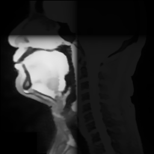||
||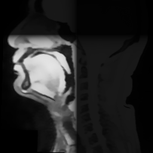||
||||
||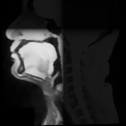||
||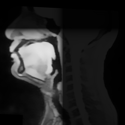||
||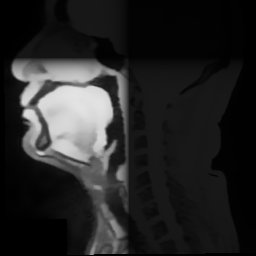||
||||
||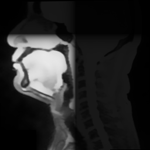||
||||
||||
||||

> 考察

- 仮ということで, 範囲がバラバラなのは一旦保留. 
- グラデーションをかけたつもりだが, 境界がハッキリしてしまっている. 
  - より段階的にグラデーションをかけた方が良い？
  - 適切な画像処理手法はないか. 
- ぼかし＋黒フィルタ, 両方やっても良いか. 
- 一旦, このデータを用いて学習を実行してみるのも良いか. 

***
## フィードバック

進捗に関して. 
- ぼかしよりも暗くした方が良さそう.
  - 併用が良いのかはわからない.
- 暗いフィルターは, 矩形ではなくて円形の方が良さそう.
- アフィンは良くないかな？と思うが…正直わからない.
- きちんと位置合わせをする上では, セグメンテーションとかをした方が良い.
  - しかし, 学習過程でその誤差を吸収する, という考えもあるため, それが妥当かはわからない.
- OpenCV を使って例外処理とかもあり. 
  - 「目的を達成したいためにはどうすれば良い？」という, 目的第一の考え方の方が良い. それだと「合わせこみたいところだけを見る」という方法になる.

学習に関して. 
- Transformer とかが最近の流行りではある.
- とりあえず学習. 

全体の流れ. 
- ひとまず, 「先行研究と比較してデータの違いによって現状はできていないところ」を解決し, 「桂田先生と同レベル」にまで到達しよう.

直近の課題.
- USC-TIMIT の入手 → 今週中に先生に OH で相談.
- 暗いフィルターを円形にかける.
- OpenCV で例外処理. 
- 学習の実行. 結果をまとめる. 
