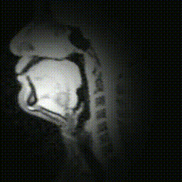

# 2023_0704_MTG

目次
- [前回の課題](#前回の課題)
- [現状の進捗](#現状の進捗)
- [フィードバック](#フィードバック)

過去の資料
- [2022_1118](./2022_1118_MTG.md)
- [2022_1215](./2022_1215_MTG.md)
- [2022_1227](./2022_1227_MTG.md)
- [2023_0620](./2023_0620_MTG.md)

## 前回の課題
- ひとまず, 「先行研究と比較してデータの違いによって現状はできていないところ」を解決し, 「桂田先生と同レベル」にまで到達したい. 
- 暗いフィルターは円形にかけた方が良いのでは. 
- ひとまず学習 (speech2mri) を実行してから, 正規化について考えるのでも良いかも. 

## 現状の進捗

今回は主に下記のことに取り組んだ. 
- 生の rtMRI で speech2mri を実行. [結果1]
- 円形に暗いフィルターをかける. 
- 円形に暗いフィルターをかけた画像で, speech2mri を実行. [結果2]
- 顔の位置を合わせる処理を OpenCV で実行 (明らかに誤検出なものは除いた) .
- フィルター処理＋顔の位置を合わせる処理をかけた画像で, speech2mri を実行. [結果3]

### 手法
_斜体_ は自分用メモ. 

**rawMRI**
- 特に何もしない. 
- データ数 : 194 movies (valid : 2 movies, test : 2 movies, train : others)
  - _DB 上は 211 動画のはず. データ移行した際に取りこぼしがあったようなので, 早めに確認する._

**フィルタリング**
- 目標 : 舌以外の箇所を暗くして, 不要な情報を学習しないようにする. 
- 処置手順 : 
  - 各動画の各フレームに同様に処理. 
  - 画像の (70, 140) を中心とする, 半径 60 pixel の白色の円, それ以外の範囲は黒色の mask 画像を生成. 
    - _ここのパラメータは現在, 私が適当に設定._ 
  - mask 画像を (251, 251) サイズの正方形カーネルでガウシアンぼかしを実行. 
    - _ここのパラメータも, 私が適当に設定._ 
  - mask 画像と元の rtMRI 画像の乗算をとり保存. 
- データ数 : 194 movies (valid : 2 movies, test : 2 movies, train : others)
  - _上と同じく, DB 上は 211 動画のはず. データ移行した際に取りこぼしがあったようなので, 早めに確認する._

1つの動画を対象とした結果. 
|before|after|
|---|---|
|||

**正規化処理**
- 目標 : 顔の位置を合わせて, 不要な情報を学習しないようにする. 
- 処理手順 : 
  - 各動画ごとに処理. (一つの動画内での正規化処理は行わない. あくまでも, 動画間の処理とする. )
  - 各動画の先頭画像を取得. 任意の一つの画像を基準とし, その基準画像との誤差 (平行移動距離, 回転角度, 拡大縮小スケール) を OpenCV で算出 ([参考](https://qiita.com/miwazawa/items/1d5e51023db86ad5f053)).
    - それぞれの画像をフーリエ変換して, パワースペクトル画像を生成. 
    - それらの相関をとった新たなパワースペクトル画像を生成. 
    - 逆フーリエ変換することで相関の強かった座標のみがハイライトされたような画像が生成. 
    - そのピーク値の座標を求めることで, 一番相関の強い座標 (誤差) を得る. 
  - 平行移動距離が 10 pixel 以上のものは誤検出として, 処理対象から除外する. 
    - _この基準は, 平行移動距離のヒストグラム (下記参照) を確認した上で, 私が任意で決定している._ 
  - 除外されなかった動画は, フィルタリングした画像を算出された誤差を基に各フレームを変換して保存. 
    - _現状では「フィルタリング→正規化」という手順になっているが, 「正規化→フィルタリング」の方が適切である. 早めに修正する._
- データ数 : 191 movies (valid : 2 movies, test : 2 movies, train : others)

ヒストグラム (横軸 : 平行移動距離, 縦軸 : 動画の度数)
 

各動画の先頭画像だけを合わせたもの. 
|rawMRI|normalize (全体)|normalize (誤差が 10 pixel 以上は除く)
|---|---|---|
||||

**speech2mri モデル**
- 目標 : 学習の実行. 
- 処理手順 : 現状では先行研究 (桂田先生の研究) の BLSTM モデルをそのまま使用. 
  - 画像を 68 × 68 pixel で読み込み. 
    - _ここの画像サイズをより大きくすれば, 精密な推定が可能になるのでは._
  - epochs = 100, batch_size = 128, shuffle = True, verbose = 1

### 結果
- 結果1 : 生の rtMRI で学習. 
- 結果2 : フィルタリングした rtMRI で学習. 
- 結果3 : フィルタリング + 正規化処理した rtMRI で学習. 

|結果1|結果2|結果3|
|---|---|---|
||||

### 考察・今後の展望
考察
- ひとまず画質が悪いので, 今後何とかする必要ありそう. 
- フィルタリングに関して. 
  - 「余計な部分の学習をしないようにする」という目的は達成できたのでは. 
  - パラメータの決め方が若干気になるが, 問題なさそうか？
- 正規化処理に関して. 
  - 「揺れ」の大きさで観察すると, 結果3が最も安定. 
    - 「フィルタリング→正規化」から「正規化→フィルタリング」に変更した方がより良くなるかも. 
    - 輪郭データは使わなくてもできそう？
  - 結果3でも最後は若干揺れている. 学習した画像を確認すると, 1枚だけ(?)大きくズレているものがありそう. 
    - 現在は正規化の基準を「移動距離が 10 pixel 以上か否か」だけで判断. MSE や SSIM などを用いて, より確実に「揺れ」の少ない画像だけを選択するなどの方法もあるか. 
  - 結果3で扱わなかったデータの正規化はどうすべきか. 
    - 手動で合わせる？基準は？

今後の展望
- 細かな問題の解決. 
  - 「フィルタリング→正規化」から「正規化→フィルタリング」
  - データの再確認. 
- MSE や SSIM を用いて, 正規化の例外処理をより正確にできないか見直す. 
- 画像サイズを大きくして学習. 

## フィードバック
