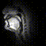

# 2023_0704_MTG

目次
- [前回の課題](#前回の課題)
- [現状の進捗](#現状の進捗)
  - [データ](#データ)
  - [手法](#手法)
  - [結果](#結果)
  - [考察](#考察)
  - [今後の展望](#今後の展望)
- [フィードバック](#フィードバック)

過去の資料
- [2022_1118](./2022_1118_MTG.md)
- [2022_1215](./2022_1215_MTG.md)
- [2022_1227](./2022_1227_MTG.md)
- [2023_0620](./2023_0620_MTG.md)

## 前回の課題
- 「先行研究と比較してデータの違いによって現状はできていないところ」を解決し, 「桂田先生と同レベル」にまで到達したい. 
- 暗いフィルターは円形にかけた方が良いのでは. 
- ひとまず学習 (speech2mri) を実行してから, 正規化について考えるのでも良いかも. 

## 現状の進捗

今回は主に下記のことに取り組んだ. 
- speech2mri の実行. 
  - 生の rtMRI で speech2mri を実行. [結果1]
  - 円形に暗いフィルターをかける. 
  - 円形に暗いフィルターをかけた画像で, speech2mri を実行. [結果2]
  - 顔の位置を合わせる処理を OpenCV で実行 (明らかに誤検出なものは除いた) .
  - フィルター処理＋顔の位置を合わせる処理をかけた画像で, speech2mri を実行. [結果3]
- USC-TIMIT の調査 → 先生がメール. 
- Vision Transformer の勉強 (記事を読むなど). 

ここでは, speech2mri の実行結果をメインに報告する. 

### データ
_斜体_ は自分用メモ. 

**rawMRI**
- 特に何もしない. 
- データ数 : 211 movies (valid : 2 movies, test : 2 movies, train : others)

**フィルタリング**
- 目標 : 舌以外の箇所を暗くして, 不要な情報を学習しないようにする. 
- 処置手順 : 
  - 各動画の各フレームに同様に処理. 
  - 画像の (70, 140) を中心とする, 半径 60 pixel の白色の円, それ以外の範囲は黒色の mask 画像を生成. 
    - _ここのパラメータは現在, 私が適当に設定._ 
  - mask 画像を (251, 251) サイズの正方形カーネルでガウシアンぼかしを実行. 
    - _ここのパラメータも, 私が適当に設定._ 
  - mask 画像と元の rtMRI 画像の乗算をとり保存. 
- データ数 : 211 movies (valid : 2 movies, test : 2 movies, train : others)

1つの動画を対象とした結果. 
|before|after|
|---|---|
|||

**正規化処理**
- 目標 : 顔の位置を合わせて, 不要な情報を学習しないようにする. 
- 処理手順 : 
  - 各動画ごとに処理. (一つの動画内での正規化処理は行わない. あくまでも, 動画間の処理とする. )
  - 各動画の先頭画像を取得. 任意の一つの画像を基準とし, その基準画像との誤差 (平行移動距離, 回転角度, 拡大縮小スケール) を OpenCV で算出 ([参考](https://qiita.com/miwazawa/items/1d5e51023db86ad5f053)).
    - それぞれの画像をフーリエ変換して, パワースペクトル画像を生成. 
    - それらの相関をとった新たなパワースペクトル画像を生成. 
    - 逆フーリエ変換することで相関の強かった座標のみがハイライトされたような画像が生成. 
    - そのピーク値の座標を求めることで, 一番相関の強い座標 (誤差) を得る. 
  - 平行移動距離が 10 pixel 以上のものは誤検出として, 処理対象から除外する. 
    - _この基準は, 平行移動距離のヒストグラム (下記参照) を確認した上で, 私が任意で決定している._ 
  - 除外されなかった動画は, 算出された誤差を基に各フレームを変換して保存. 
  - 上と同じ手法でフィルタリング. 
- データ数 : 208 movies (valid : 2 movies, test : 2 movies, train : others)

ヒストグラム (横軸 : 平行移動距離, 縦軸 : 動画の度数)
 

各動画の先頭画像だけを合わせたもの. 
|rawMRI|normalize (全体)|normalize (誤差が 10 pixel 以上は除く)
|---|---|---|
||||

**比較**
各動画の先頭画像のみを並べた. 

|rawMRI|フィルタリングのみ|フィルタリング+正規化|
|---|---|---|
||||

## 手法

**音声ファイル**
- 音響特徴量
  - MGC-LSP (Mel-Generalized Cepstral) : 線形予測係数 (LPC) を用いて推定. 
  - 基本周波数 (Fundamental Frequency) : SWIPE アルゴリズムを用いて推定. 
- パラメータ
  - _現時点では, 概ね先行研究と同等の値に設定. わかっていない箇所が多い._
  - _フレームシフトを変更したら, 生成される動画の長さが変わった. 要調整と考えられる._

|パラメータ|数値|備考|
|---|---|---|
|サンプリング周波数(Hz)|20000|新しく生成される音声のサンプリング周波数. |
|フレーム長|256|音声信号をフレームに分割する際のフレームの長さ. 2のべき乗である必要がある. |
|フレームシフト|368|フレームのオーバーラップを制御するためのパラメータで, フレーム間の重なりを指定. |
|alpha|0.42|MGC-LSPを計算するパラメータ. pysptkというライブラリを使用. |
|stage|3|MGC-LSPを計算するパラメータ. ステージ数を表す. |
|MGC-LSPの次数|24|
|F0推定における最小の基本周波数(Hz)|50|この値以下の基本周波数は推定されない. |
|F0推定における最大の基本周波数(Hz?)|400|この値以上の基本周波数は推定されない. |

**speech2mriモデル**
- 目標 : 学習の実行. 
- 処理手順 : 現状では先行研究 (桂田先生の研究) の BLSTM モデルをそのまま使用. 
  - 画像を 68 × 68 pixel で読み込み. 
  - 音響特徴量情報を書いたファイルを読み込む. 
  - epochs = 100, batch_size = 128, shuffle = True, verbose = 1

### 結果
推定された動画を示す. 
- 結果1 : 生の rtMRI で学習. 
- 結果2 : フィルタリングした rtMRI で学習. 
- 結果3 : フィルタリング + 正規化処理した rtMRI で学習. 

|結果1|結果2|結果3|
|---|---|---|
||||

### 考察

フィルタリングに関して. 
- 目標「余計な部分の学習をしないようにする」は達成できたのでは. 
- パラメータの決め方が若干気になるが, 現状でも問題なさそうか？

正規化処理に関して. 
- 目標「顔の位置を合わせて, 不要な情報を学習しないようにする」は, 
- 「揺れ」の大きさで観察すると, 結果3が最も安定. 
  - 輪郭データは使わなくてもできそう？
  - 目標「顔の位置を合わせて, 不要な情報を学習しないようにする」は, 結果2と3を比較すれば, 3の方が達成はされていそう. 
- 結果3でも最後は若干揺れている. 学習した画像を確認すると, 1枚だけ(?)大きくズレているものがありそう. 
  - 現在は正規化の基準を「移動距離が 10 pixel 以上か否か」だけで判断. MSE や SSIM などを用いて, より確実に「揺れ」の少ない画像だけを選択するなどの方法もあるか. 
- 結果3で扱わなかったデータの正規化はどうすべきか. 
  - 手動で合わせる？基準は？
  - 完全に除外した方が再現性は担保される. 

その他
- 画像のサイズが小さいため, 解像度が悪い. 
  - 試しに研究室の GPU に接続して実行したが, メモリが特別大きいわけではないので, 256×256 px では実行不可能だった.
  - メモリの大きい PC が必要？ (一旦は同期の PC を借りるか. )
- なぜか出力される動画が 1:16 になる (元の MRI は 0:18) . 
  - 音響特徴量の算出のパラメータを変更したら長さが変わった. 
  - パラメータの設定 or 動画の出力に問題があるのでは？要確認. 

### 今後の展望
- MSE や SSIM を用いて, 正規化の例外処理をより正確にできないか見直す. 
- 画像サイズを大きくして学習に挑戦？
- データの生成の話よりも, モデルの構築の方に努めるべきか. 
  - Vision Transformer を用いたモデル構築？

## フィードバック

