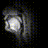

# 2023_1011_MTG

目次
- [前回の進捗](#前回の進捗)
- [現状の進捗](#現状の進捗)
- [考えている点](#考えている点)
- [フィードバック](#フェードバック)

過去の資料
- [2022_1118](./2022_1118_MTG.md)
- [2022_1215](./2022_1215_MTG.md)
- [2022_1227](./2022_1227_MTG.md)
- [2023_0620](./2023_0620_MTG.md)
- [2023_0718](./2023_0718_MTG.md)

***

# 前回の進捗
- 正規化とフィルタリングを実行した. -> 詳細は[こちら](./2023_0718_MTG.md)参照. 

推定結果

|元の動画|① 生の rtMRI |② 正規化のみ|③ 正規化+フィルタリング|
|---|---|---|---|
|||| |

課題
- 正規化をする際には舌を除き, 剛体部分のみを対象とした方が良い. 
- 動画がなぜか長くなる.  -> 音響特徴量の算出に問題がありそう. 
- 桂田先生と同じ評価を行った方が良い. 

***

# 現状の進捗

今回は主に下記のことに取り組んだ. 
1. 剛体部分のみを対象とし, 正規化処理を実行した. 
2. 音響特徴量算出時のパラメータを調整し, 正しい学習が実行されるようにした. 
3. 桂田先生と同じ手法で定量的評価を行った. 
  - けど, 先行研究を確認したところやや算出方法が異なりそうなので, 今後調整する. 

今後の課題. 
- ViT の利用. (10月中になんとかしたい. )

## 1. 正規化処理の改良

- 課題: 正規化する際に, 軟体部分も含めて画像全体を解析対象としている. 剛体部分だけを見ては. 
- 解決: アノテーションを実施し, 剛体部分だけを解析対象とした. 

> 手法

- 各動画ごとに処理. (一つの動画内での正規化処理は行わない. あくまでも, 動画間の処理とする. )
- 各動画の先頭画像を取得. **アノテーションして, 剛体部分のみを検出**. 
  - アノテーションした領域.  
- 任意の一つの画像を基準とし, その基準画像との誤差 (平行移動距離, 回転角度, 拡大縮小スケール) を位相限定相関法を用いて取得. 
  - 位相限定相関法の概略([参考](https://qiita.com/miwazawa/items/1d5e51023db86ad5f053)).  
- 平行移動距離が 10 pixel 以上のものは誤検出として, 処理対象から除外する. 
  - 算出された平行移動距離の結果 (横軸: 平行移動距離, 縦軸: 動画の度数) .  
- 算出された誤差を基に各フレームを変換して保存. 

> 結果

- 4 つの動画が「誤差 10 pixel 以上」で除外された. 
- アノテーションの有無によって違いは生じなかった. 

各動画の先頭画像のみを繋ぎ合わせた結果. 

|raw|normalized|
|---|---|
|||

## 2. 音響特徴量算出時のパラメータの調整

- 課題: なぜか推定結果の動画の秒数が長い. 
- 原因: 「1つの音響特徴量」に対して「1つの画像」を出力.  　　  = 音響特徴量算出時のフレーム長・フレームシフトの設定が適切でない.  　　  = 学習時にも影響しているのでは？
- 確認: 「フレーム長: 256, フレームシフト: 100」としていて, 学習に「ズレ」が生じていた. 
- 解決: 「音声のフレーム数 = 画像のフレーム数 + 1」となるように, フレーム長・フレームシフトを調整した. 

|before|after|
|---|---|
|||

> 手法

- サンプリング周波数: 20kHz, フレーム長: 2048, フレームシフト: 1740 に設定. 
  - wav がステレオになっていたので, そこは今後調整する. 
- 「音声のフレーム数 = 画像のフレーム数 + 1」が成立しない動画資料は, 学習から除外. 
  - 17 動画が除外された. 

> 結果

- 推定動画は元動画と同じ秒数になった. (問題は解決. )
- 推定結果が明らかに良くなった. 
  - 今回の結果では, フィルタリングの効果が以前より見えにくい？
  - 画像の端におけるフィルタリングは必要そう. もう少し暗くする領域を狭くしてみるか. 

||元の動画|① raw|② 正規化|③ 正規化+フィルタリング|
|---|---|---|---|---|
|前回|||||
|今回|||||

## 3. 定量的評価

- 課題: 桂田先生が行っていた定量的評価にまだ取り組めていない. 
- 解決: MSE と SSIM を算出してみた. 
  - 先行研究を確認したところ算出方法が現状の計算方法と若干異なることが分かったので, 再度調整する. 

> 手法

||MSE（Mean Squared Error）|SSIM（Structural Similarity Index）|
|---|---|---|
|概要|- 画像や信号の品質を評価するための基準. 元の画像と復元された画像がどれだけ近いかを定量的に評価.  - MSEが0に近いほど, 2つの画像は非常に似ている. (ただし, この評価は人間の視覚には必ずしも一致しない. )|- 画像品質を評価する基準. 人間の視覚システムの特性を模倣して設計されている.  - 輝度, コントラスト, 構造といった要素を考慮して, 2つの画像がどれだけ視覚的に類似しているかを測定.|
|数式| | |
|基準||

> 結果

動画は上の「2. 音響特徴量算出時のパラメータの調整」の「今回」と同じ. 
- ③条件が②よりも良いというわけではない結果になった. 
  - ③条件ではフィルタリングが実行されているため, 舌付近のみが解析対象となっている. 一方で, ①②では画像全体である. 
  - 特に推定したいのは舌付近の動き. では, ⓪①②も全て同様のフィルタリングをしてから MSE, SSIM を算出するか. 

||⓪ 元の動画|① raw|② 正規化|③ 正規化+フィルタリング|
|---|---|---|---|---|
|動画|||||
|MSE|350.3|293.7|373.3|
|SSIM|0.96|0.98|0.88|

なお, 先行研究 (桂田先生の研究室の方, 海外の研究 [pdf](https://arxiv.org/abs/2008.02098) [web](http://smartlab.tmit.bme.hu/interspeech2020_speech2mri) ) では異なるデータだが, 同様のモデルで以下の結果が得られている. 
- 算出方法が異なるので, 要調整. 
- 「画像内の特定の領域のみ」等の処理は行っていなさそう. あくまでも画像全体を対象としている. 
  - ただし, SSIM 算出時はガウシアンで重みづけて「各ピクセルごとにそのピクセルと近い部分に注目してSSIMを算出 -> 算出された各ピクセルごとの平均を『その画像におけるSSIM』」としている. 

||被験者1|被験者2|被験者3|被験者4|ave|
|---|---|---|---|---|---|
|MSE|0.0023|0.0046|0.0035|0.0038|
|SSIM|0.8|0.73|0.81|0.77|

***

# 考えている点

1. 評価の方法をどうすべきか. 
- 全て同様のフィルタをかけてから比較する？
- 桂田先生の「MRI→音声」の利用？
- 被験者ごとの比較. 

2. 画像のサイズをどうすべきか. 
- メモリが足りないため, 256×256 px を 68×68 px に小さくして学習している. よって, 推定される動画も 68×68 px である. 
  - 自分の PC: 8 GB
  - 菊池研の CPU: 16 GB
  - 菊池研の GPU に繋げるようにコードを書き換えれば, 48 GB までは利用できそう. 
- 「現状でも結果が出ているのでこのまま 68×68 px で行く」or「 256×256 px で学習する」, どちらが良いか. 

3. フィルタリングは適切か. 
- 画像の端が切れているのは問題のため, 画像の端には必要そう. 
- 声帯が映っていないと問題か？もう少し幅を広げるべきか. 

***

# フェードバック

